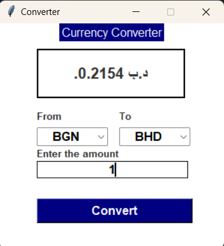

# Currency Converter

A simple currency converter application built with Python and Tkinter. The application allows users to convert amounts between different currencies using real-time exchange rates fetched from an API.

## Features
- Real-time currency conversion using a reliable API.
- Easy-to-use graphical user interface (GUI) built with Tkinter.
- Dropdown lists for selecting the source and target currencies.
- Supports a wide range of currencies.
- Plays a sound effect upon successful conversion.

## Getting Started

### Prerequisites
Ensure you have Python installed along with the following libraries:
- `requests`
- `tkinter`
- `Pillow` (optional, if you want to extend functionality with images)
- `winsound` (only for Windows)

You can install the required libraries using:
```bash
pip install requests pillow

## Installation

1. Clone the repository:

    ```bash
    git clone https://github.com/shatakshi-sinha/Real-Time-Currency-Convertor.git

    ```

2. Navigate to the project directory:

    ```bash
    cd Real-Time-Currency-Convertor
    ```

3. Run the script:

    ```bash
    python main.py
    ```

**Note:** Ensure you have Python and the necessary libraries installed on your system. Instead, you can also use Anaconda to run this script as it contains all the used libraries inbuilt.

### Code Overview

- **convert()**: Fetches real-time exchange rates from the API and displays the converted amount.
- **get_currency_symbol(currency)**: Returns the symbol for the selected currency.
    
The GUI is built using the Tkinter library with dropdown lists for selecting currencies, an entry field for the amount, and a convert button.

## API Information

This application uses the [Currency Converter API](https://rapidapi.com) to fetch exchange rates. You'll need to provide your own API key for the conversion to work.

Replace the following line in the code with your API key:
```bash
'x-rapidapi-key': 90c59d6c9fmsh4599f814e2ffc92p17fc6djsndeaa0265ac61
```

## Customization

You can easily add more currencies by updating the currency_names list and the symbols dictionary in the code.

## Example GUI



## Future Improvements
- Adding support for historical exchange rates.
- Allowing users to save favorite conversions.
- Enhancing the GUI with additional features like currency flags.

## License

This project is licensed under the MIT License - see the [LICENSE](LICENSE) file for details.


